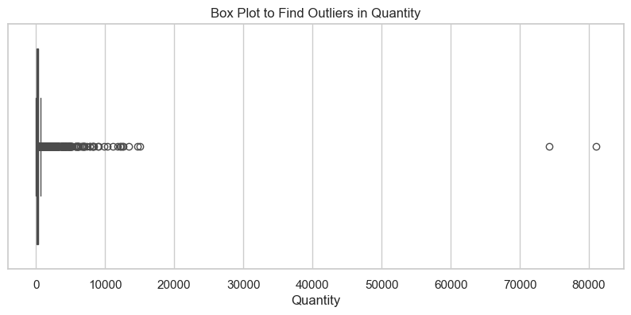
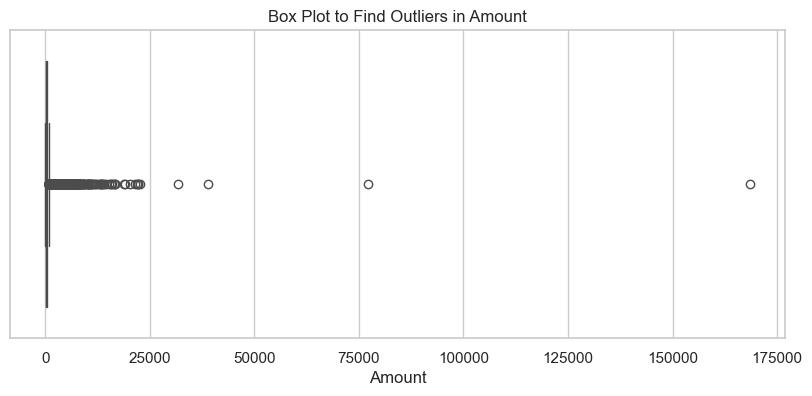
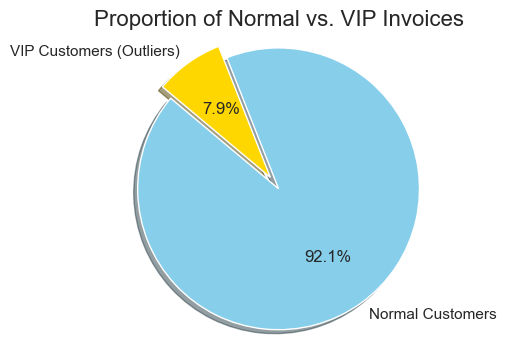
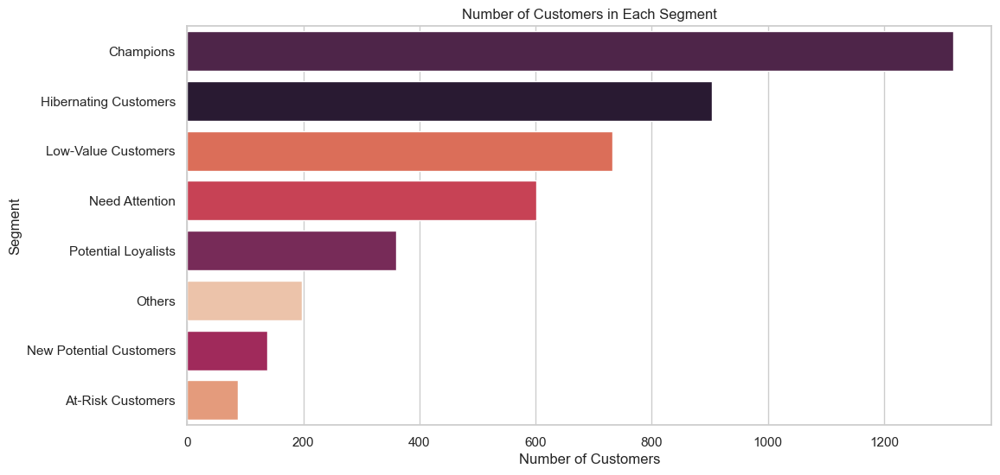

# Customer Segmentation using RFM Analysis (RFM)

This project analyzes customer transaction data to segment customers into distinct groups based on their purchasing behavior. The primary goal is to identify different customer archetypes to enable targeted marketing strategies. The analysis uses value-based segmentation and the RFM (Recency, Frequency, Monetary) model.

### 1. Data Loading and Initial Inspection

- **Database Connection**: A connection to the `CustomerDB` SQL Server database was established using `sqlalchemy` and `pyodbc`.
- **Data Retrieval**: The `Customers` table was loaded into a pandas DataFrame.
- **Initial Assessment**: An initial review was conducted using `df.info()` to check data types and null values, and `df.describe()` to get statistical summaries of the numerical columns.

### 2. Data Cleaning

To ensure data quality, the following preprocessing steps were performed:

-  **Handling Missing Values**: Rows with missing `CustomerID` values were removed, as they are essential for this analysis.  A total of 3,724 rows with null CustomerIDs were identified.
-  **Removing Duplicates**: Any duplicate rows in the dataset were dropped to avoid data redundancy.
- **Correcting Data Types**: Column data types were adjusted for accurate analysis:
  -  `Amount` was converted from object to float.
  -  `CustomerID` was converted from float to integer.
  -  `InvoiceDate` was converted to datetime objects.
-  **Removing Cancellations**: Transactions with a negative or zero `Quantity` were filtered out to exclude canceled orders and returns from the analysis.

### 3. Exploratory Data Analysis (EDA) & Outlier Detection

-  Box plots were generated for the `Quantity` and `Amount` columns to visually identify outliers in the data. These plots helped in understanding the distribution of transaction values and quantities.

### 4. Value-Based Customer Segmentation

An initial, simple segmentation was performed to distinguish between high-value and standard transactions.

-  **IQR Method**: The Interquartile Range (IQR) was calculated for the `Amount` column.
-  **VIP vs. Normal Customers**: An upper bound was defined as $Q3 + 1.5 * IQR.  Transactions with an `Amount` exceeding this threshold (`941.38`) were classified as 'VIP', while the rest were 'Normal'.
-  **Visualization**: A pie chart was created to show the proportion of VIP (7.9%) versus Normal (92.1%) invoices.

### 5. RFM (Recency, Frequency, Monetary) Analysis

To achieve a more nuanced segmentation, the RFM model was applied:

-  **Calculate RFM Values**: For each `CustomerID`, the following metrics were computed:
  -  **Recency**: Days since the customer's last purchase.
  -  **Frequency**: Total number of unique invoices.
  -  **Monetary**: Total amount spent.
-  **Assign RFM Scores**: Customers were scored from 1 to 4 for each RFM metric based on quartiles.  A combined `RFM_Score` was created by concatenating these scores.

### 6. Customer Segmentation & Visualization

-  **Segment Definition**: Customers were categorized into actionable segments like 'Champions', 'At-Risk Customers', 'Potential Loyalists', and 'Hibernating Customers' using a predefined mapping based on their RFM scores.
-  **Final Visualization**: A horizontal bar chart was generated to display the total number of customers within each defined segment, providing a clear view of the customer base distribution.

## Technologies Used

- **Python**
-  **Pandas**: For data manipulation and analysis.
-  **SQLAlchemy**: For database connection.
-  **Matplotlib & Seaborn**: For data visualization.

